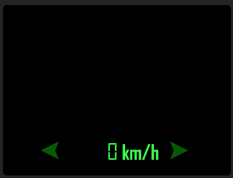

# OpenGL - CarGUI

### SparseDrive ( Detection, VectorMap, Motion planning )


### Other models ( Detection, SegMap )


## Introduction
An on-board display system for autonomous driving, including surrounding traffic environment, front and back camera images, speedometer, turn singal and speed limit reminder.

We use those models to get environment infomation:

- SparseDrive (detection, vector map, motion planning)
- StreamPETR (detection)
- BEVFormer (dectction, segmentation map)


### Available display objects in surronding environment :
- car
- truck
- bus
- pedestrian
- motorcycle
- traffic_cone


## Installation
### Create conda environment:


```bash
conda create -n cargui python=3.9
conda activate cargui
```


Install  Packages：
```
pip install -r requirements.txt
```

Ubuntu requires opencv-headless
```
pip install opencv-python-headless
```
---

### Install Dataset-Related Packages：

To set up the required environment for working with datasets, install the following packages:


Install nuScenes Devkit：
```bash
pip install nuscenes-devkit
```


## Usage

### 1. set configuration 

check config.yaml

draw_mode

- "3d" for 3d bbox only
- "2d" for 2d bbox only
- "seg" (BEVFormer) for segmemtation bev map + 3d bbox
- "vec" (SparseDrive) for vector map + 3d bbox + motion preditcion


ip, port: receiver client ip

### 2. start GUI client
```
python qtGUI.py
```
 
### 3. check data format
one frame data example:<br>
3d mode:
```
{
 'img':{
        'CAM_FRONT': str,
        'CAM_BACK':  str
        },   
 'obj':[{
        'x':    float,
        'y':    float,
        'cls':  str,
        'ang':  float
        }, ...]
 'speed':       float,  # optional
 'steering':    float   # optional
}
```
- img (dict)<br>
all image shape should be resize to (470, 264) and encoded by base64

- obj (list of dicts)<br>
all object of current frame, x y are object world coordinate, and should be normalized to -0.5 ~ 0.5, cls is in one of available classes we mention above, ang is object heading angle

- speed (optional)<br>
ego car speed

- steering (optional)<br>
ego car steering

### 4. send data to GUI client
using TCP to connent GUI client and send single frame data
```
import socket
import json

MAX_CHUNK_SIZE = 5000
client_socket = socket.socket(socket.AF_INET, socket.SOCK_STREAM)
client_socket.connect((${CLIENT_IP}$, ${CLIENT_PORT}$))

'''
preparing single frame data...
'''

data_send = json.dumps(data_send).encode("utf-8")

data_send += ("\0").encode("utf-8")

for i in range(0, len(data_send), MAX_CHUNK_SIZE):
    client_socket.sendall(data_send[i : i + MAX_CHUNK_SIZE])

```

you can refer sender/DataSender_TCP_3d.py for more detail

##  Other reference documents

1. If you want to perform a display test in occupancy mode.
[HERE](docs/run_occ.md)

2. If you want to refer to how to place datasets using symbolic links.
[HERE](docs/Symb_link.md)


